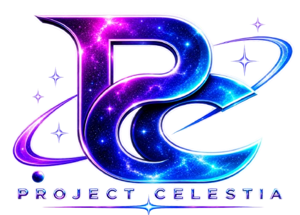
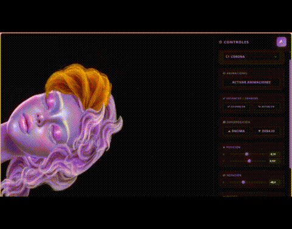

# 🌌 Project Celestia - Visor de Coordenadas y Propiedades para Capas PNG

<p align="center">
  
</p>

<p align="center">
  <em>La herramienta técnica para desarrolladores que necesitan trasladar sprites PNG a su código con precisión absoluta.</em>
</p>

<div align="center">

[](https://github.com/tu-usuario/project-celestia)
[](https://threejs.org/)
[](https://developer.mozilla.org/es/docs/Web/JavaScript)
[](https://developer.mozilla.org/es/docs/Web/HTML)
[](https://developer.mozilla.org/es/docs/Web/CSS)
[](LICENSE)

</div>

<p align="center">
  
</p>

---

## 📑 Índice

- [📖 Descripción General](#-descripción-general)
- [🚀 Stack Tecnológico](#-stack-tecnológico)
- [📂 Estructura del Proyecto](#-estructura-del-proyecto)
- [⚙️ Características Clave](#️-características-clave)
- [🎨 Activos Gráficos y Autoría](#-activos-gráficos-y-autoría)
- [🔄 Flujo de Trabajo](#-flujo-de-trabajo)
- [🛠️ Instalación y Configuración](#️-instalación-y-configuración)
- [🧪 Pruebas Técnicas](#-pruebas-técnicas)
- [📜 Licencia](#-licencia)

---

## 📖 Descripción General

**Project Celestia** no es un editor para crear animaciones. Es una herramienta de **medición y análisis técnico** diseñada específicamente para **desarrolladores de videojuegos, aplicaciones y diseñadores técnicos** que necesitan conocer los valores numéricos exactos (posición X/Y, escala, opacidad, rotación, curvatura) de una capa PNG (sprite) individual.

Su función principal es permitirte **mover, escalar y ajustar** cualquier capa PNG dentro de un lienzo, mientras el panel lateral te muestra en tiempo real la medida exacta que estás ejerciendo sobre esa capa.

**¿Por qué es útil?** Porque al conocer estos valores exactos, puedes trasladarlos directamente a tu código (Unity, Unreal Engine, Godot, motores propios o frameworks web) sin necesidad de adivinar ni hacer pruebas manuales.

> 🚀 **Visión a Futuro:** Aunque la versión actual está diseñada para capas PNG, la arquitectura del proyecto es modular y escalable, preparada para futuras versiones que integrarán modelos 3D, animaciones complejas y exportación de datos en formato JSON u otros estándares de la industria.

---

## 🚀 Stack Tecnológico

| Capa | Tecnología |
|------|------------|
| **Motor Gráfico** | Three.js (WebGL) |
| **Lenguaje** | JavaScript (ES6 Modules) |
| **Interfaz** | HTML5, CSS3 |
| **Almacenamiento** | Historial en memoria (Undo/Redo) |
| **Arquitectura** | Cliente-Servidor (Web) |

---

## 📂 Estructura del Proyecto

```text
/
├── assets/
│   ├── css/
│   │   └── style.css
│   ├── img/
│   │   ├── 01_rostro/
│   │   │   ├── 01_Rostro_Base_Completa.png
│   │   │   ├── 02_Nariz.png
│   │   │   ├── 03_Labios.png
│   │   │   ├── 04_Ojo_Izquierdo.png
│   │   │   ├── 05_Ojo_Derecho.png
│   │   │   ├── 06_Parpado_Izquierdo.png
│   │   │   ├── 07_Parpado_Derecho.png
│   │   │   ├── 08_Pestanas.png
│   │   │   ├── 09_Cejas.png
│   │   │   └── 10_Control_Glow.png
│   │   ├── 02_cabello/
│   │   │   ├── 01_Corona_Superior.png
│   │   │   ├── 02_Frontal_Superior.png
│   │   │   ├── 03_Lateral_Superior_Derecho.png
│   │   │   ├── 04_Central_Derecho.png
│   │   │   ├── 05_Lateral_Inf_Derecho.png
│   │   │   ├── 06_Puntas_Derechas.png
│   │   │   ├── 07_Inferior_Central.png
│   │   │   ├── 08_Masa_Inf_Principal.png
│   │   │   ├── 09_Central_Izquierdo.png
│   │   │   ├── 10_Inferior_Izquierdo.png
│   │   │   └── 11_Cuello_Hombro.png
│   │   └── ui/
│   │       ├── pc.png           
│   │       └── favicon.ico
│   └── js/
│       └── script.js
├── index.html
├── .gitignore
├── LICENSE
└── README.md                   # Documentación del proyecto
```

## ⚙️ Características Clave

### 🎯 Medición Técnica en Tiempo Real

El panel lateral te permite seleccionar cualquier capa PNG del lienzo y modificar sus propiedades. Project Celestia calcula y muestra instantáneamente los valores exactos:

| Propiedad | Descripción |
|-----------|-------------|
| **Posición X/Y** | Coordenadas en el plano del lienzo |
| **Rotación Z** | Ángulo de rotación en grados |
| **Escala X/Y** | Factor de escala horizontal y vertical |
| **Opacidad (α)** | Transparencia de la capa (0.0 a 1.0) |
| **Curvatura (Bend X/Y)** | Distorsión o deformación de la geometría de la capa |

### 🖱️ Interacción y Manipulación

- **Selección de Capas**: Haz clic sobre cualquier elemento del lienzo para seleccionarlo, o usa el menú desplegable del panel para elegir una capa específica.
- **Arrastre Libre**: Mueve las capas arrastrándolas con el mouse para obtener coordenadas dinámicas.
- **Control de Superposición**: Usa los botones "Encima" y "Debajo" para alterar el orden de renderizado (Render Order) de las capas.

### 💾 Historial de Trabajo

- **Undo / Redo**: Con soporte para teclado (`Ctrl+Z` / `Ctrl+Y`) y botones en el panel, con un historial máximo de 10 estados.
- **Reset de Capa / Reset Total**: Restaura los valores originales de una capa o de todas las capas con un solo clic.

### 🛡️ Protección Anti-Inspección

- **Detección de DevTools**: El sistema detecta la apertura de herramientas de desarrollo (F12 o atajo) y activa medidas de protección temporales.
- **Bloqueo de Selección**: Deshabilita la selección de texto y el clic derecho sobre el lienzo para proteger el entorno de trabajo.

---

## 🎨 Activos Gráficos y Autoría

Todos los recursos visuales utilizados en este proyecto, incluyendo:

- **Logo de Project Celestia** (diseño tipográfico con efecto arcoíris/onda).
- **Personaje "Celestia"** (rostro, ojos, pestañas, cejas, labios y cabello en múltiples capas PNG).

Son **100% de mi autoría (Copyright © 2026)**. Estos activos fueron diseñados y renderizados específicamente para **Project Celestia** con el fin de demostrar la capacidad de medición y análisis de coordenadas de la herramienta.

> **Aviso de Licencia:** Estos activos están incluidos en este repositorio bajo la misma **Licencia MIT** que cubre el código fuente. Esto significa que se pueden usar, copiar, modificar y distribuir libremente, siempre que se conserve el aviso de copyright original y esta licencia.

---

## 🔄 Flujo de Trabajo

**1. Abrir Project Celestia**: Carga el visor en tu navegador.
**2. Seleccionar la Capa PNG**: Haz clic sobre la capa que deseas analizar (o selecciónala desde el menú desplegable).
**3. Ajustar y Medir**: Mueve, escala o rota la capa. El panel lateral te mostrará instantáneamente la coordenada o propiedad exacta que estás aplicando.
**4. Trasladar a tu Código**: Copia los valores mostrados (ejemplo: `posX: 0.35, scaleY: 0.4, opacity: 0.8`) y pégalos en tu motor de juego o código fuente.
**5. Iterar**: Usa Undo/Redo para comparar diferentes posiciones o configuraciones hasta encontrar la perfecta para tu desarrollo.

---

## 🛠️ Instalación y Configuración

### Requisitos Previos

| Requisito | Versión |
|-----------|---------|
| **Navegador Web** | Chrome, Firefox, Edge (versiones modernas) |
| **Editor** | Visual Studio Code (Recomendado) |

### ⚠️ IMPORTANTE: ¿Por qué necesitas un servidor local?

Este proyecto utiliza Módulos ES6 (import/export) y carga texturas mediante Three.js. Por razones de seguridad (política **CORS**), los navegadores bloquean la ejecución de scripts y la carga de recursos cuando intentas abrir el archivo `index.html` haciendo doble clic sobre él (protocolo `file:///`).

**Es obligatorio ejecutar el proyecto a través de un servidor HTTP local.**

### 🚀 Método Recomendado: Instalar "Live Server" (Extensión de VS Code)

**1. Instalar la extensión**: Abre Visual Studio Code, ve al panel de Extensiones (Ctrl+Shift+X) y busca **"Live Server"** (de Ritwick Dey). Haz clic en "Instalar".
**2. Abrir el proyecto**: Abre la carpeta del proyecto en VS Code.
**3. Iniciar el servidor**: Haz clic derecho sobre el archivo `index.html` y selecciona "Open with Live Server".
**4. Acceder al visor**: El navegador se abrirá automáticamente en `http://127.0.0.1:5500` y estará listo para usar. Además, se recargará automáticamente cada vez que guardes cambios en tu código.

### 🐍 Alternativa sin instalar extensiones (Python)

Si prefieres no instalar nada, puedes usar la terminal integrada de VS Code y ejecutar:

## Ubícate en la carpeta del proyecto en la terminal y ejecuta:

```bash
python -m http.server 8000
```

## 🧪 Pruebas Técnicas

Aunque Project Celestia es una herramienta de medición, el sistema subyacente fue sometido a pruebas para garantizar su precisión:

| Tipo de Prueba | Descripción |
|----------------|-------------|
| **Renderizado** | Verificación de la correcta visualización de las capas y su orden (Render Order) |
| **Interacción** | Validación de que los controles del panel reflejen en tiempo real las coordenadas exactas |
| **Historial** | Pruebas exhaustivas del sistema Undo/Redo para asegurar que no se pierdan los valores al deshacer |
| **Rendimiento** | Optimización del renderizado para mantener 60 FPS incluso con múltiples capas activas |

---

## 📜 Licencia

📄 **Ver archivo [LICENSE](LICENSE) para más detalles.**

---

<p align="center">
  <sub>© 2026 Project Celestia. Todos los derechos reservados.</sub>
</p>

<p align="center">
  <sub>Hecho con ❤️ para la comunidad de desarrolladores.</sub>
</p>
